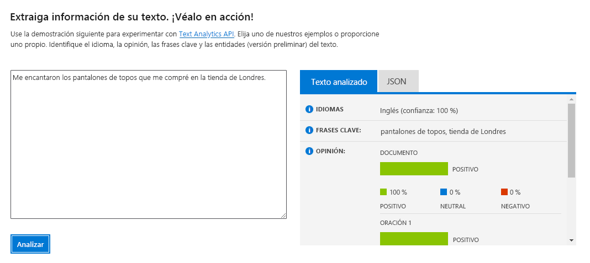
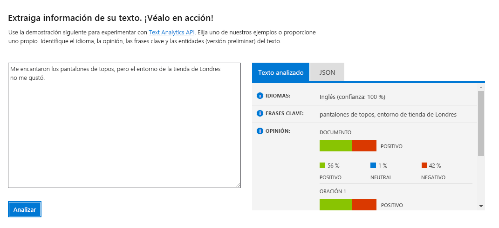

# <a name="aiml40---taking-models-to-the-next-level-with-azure-machine-learning-best-practices"></a>AIML40: Traslado de modelos al siguiente nivel con los procedimientos recomendados de Azure Machine Learning

## <a name="session-information"></a>Información de la sesión

La inteligencia artificial y el aprendizaje automático se pueden usar de muchas maneras para aumentar la productividad de los procesos empresariales y recopilar información significativa mediante el análisis de imágenes, textos y tendencias dentro de flujos de datos no estructurados. Aunque muchas tareas se pueden resolver mediante modelos existentes, en algunos casos también es necesario entrenar un modelo propio para tareas más específicas o para obtener una mayor precisión. 

En esta sesión, se explorará la ruta completa de la integración de servicios inteligentes de análisis de texto en los procesos empresariales de [Tailwind Traders](http://tailwindtraders.com), empezando por los modelos precompilados disponibles como [servicios cognitivos](https://azure.microsoft.com/services/cognitive-services/?WT.mc_id=msignitethetour2019-github-aiml40), hasta el entrenamiento de un modelo neuronal personalizado de terceros para [análisis de sentimiento basado en aspectos](https://www.intel.ai/introducing-aspect-based-sentiment-analysis-in-nlp-architect/) disponible como parte de la [arquitectura NLP de Intel](http://nlp_architect.nervanasys.com/) con [Azure Machine Learning Service](https://azure.microsoft.com/services/machine-learning-service/?wt.mc_id=msignitethetour2019-github-aiml40). Se describirán casos en los que se necesita un modelo personalizado y se mostrarán formas rápidas de crear este tipo de modelo desde cero con [AutoML](https://docs.microsoft.com/azure/machine-learning/service/concept-automated-ml/?wt.mc_id=msignitethetour2019-github-aiml40) y cómo ajustar los hiperparámetros del modelo con [HyperDrive](https://docs.microsoft.com/azure/machine-learning/service/how-to-tune-hyperparameters/?wt.mc_id=msignitethetour2019-github-aiml40)

# <a name="table-of-content"></a>Tabla de contenido
 

| Recursos          | Vínculos                            |
|-------------------|----------------------------------|
| PowerPoint        | - [Presentación](presentations.md) |
| Vídeos            | - [Ensayo del simulacro](https://youtu.be/If9IQm3gWVQ) <br/>- [Microsoft Ignite Orlando Recording](https://myignite.techcommunity.microsoft.com/sessions/83002?source=sessions) |
| Demostraciones             | - [Demostración 1: Text Analytics de Cognitive Services](https://github.com/microsoft/ignite-learning-paths-training-aiml/tree/master/aiml40#demo-1-text-analytics-cognitive-service) <br/>- [Demostración 2: Aprendizaje automático automatizado](https://github.com/microsoft/ignite-learning-paths-training-aiml/tree/master/aiml40#demo-2-azure-automl) <br/>- [Demostración 3: SDK de Azure Machine Learning e Hyperdrive](https://github.com/microsoft/ignite-learning-paths-training-aiml/tree/master/aiml40#demo-3-using-azure-ml-workspace-with-python-sdk) |

## <a name="delivery-assets"></a>Recursos de entrega

* [Presentación de PowerPoint](https://github.com/microsoft/ignite-learning-paths-training-aiml/blob/master/aiml40/presentations.md)
* [Recursos adicionales para el presentador](README-Instructor.md)
* Vídeos de demostración:
    * Demostración 1: [Text Analytics de Cognitive Services](https://youtu.be/QJxjm5BirOA)
    * Demostración 2: [Aprendizaje automático automatizado](https://youtu.be/qrstXN6TLZk)
    * Demostración 3: [SDK de Azure Machine Learning e Hyperdrive](https://youtu.be/sccNTPO3PwU)


## <a name="overview-of-demonstrations"></a>Información general de las demostraciones

En esta presentación se realizan las demostraciones siguientes:

1. Uso de [Text Analytics de Cognitive Services](https://azure.microsoft.com/services/cognitive-services/text-analytics/?wt.mc_id=msignitethetour2019-github-aiml40) para determinar la opinión de una revisión de prendas.
2. Uso de [ML automatizado de Azure](https://docs.microsoft.com/azure/machine-learning/concept-automated-ml?wt.mc_id=msignitethetour2019-github-aiml40) para crear un clasificador de texto casi sin código.
3. Uso de [Azure Machine Learning Service](https://azure.microsoft.com/services/machine-learning-service/?wt.mc_id=msignitethetour2019-github-aiml40) para entrenar un modelo de Análisis de sentimiento basado en aspectos.

>  💡 **IMPORTANTE: Debe ejecutar todas las instrucciones y demostraciones antes de pasar a la fase para ofrecer este contenido**. Las demostraciones tardan mucho tiempo en ejecutarse y procesarse, por lo que sea consciente de que el tiempo de preparación de esta sesión es clave para realizarla correctamente. Debería ejecutarse cada sección para obtener un identificador que pueda sustituir en los cuadernos cuando esté en la fase en lugar de esperar a que finalicen los experimentos (la sesión no es lo suficientemente larga para ejecutar un experimento sencillo).

## <a name="starting-fast"></a>Inicio rápido

Si quiere comenzar de inmediato, puede implementar todos los recursos necesarios mediante la plantilla de Azure. 

<a href="https://portal.azure.com/#create/Microsoft.Template/uri/https%3A%2F%2Fraw.githubusercontent.com%2Fmicrosoft%2Fignite-learning-paths-training-aiml%2Fmaster%2Faiml40%2Ftemplate%2Fazuredeploy.json" target="_blank">
 
</a>

A continuación se proporcionan instrucciones más detalladas para la demostración, a fin de que pueda realizar los pasos manualmente para comprender totalmente los conceptos que se muestran.

# <a name="initial-environment-setup"></a>Configuración inicial del entorno

Para realizar la demostración 2, tendrá que:

1. Crear un área de trabajo de Azure Machine Learning
2. Crear un clúster de proceso de entrenamiento en Azure Machine Learning
3. Cargar los datos que se usan para el entrenamiento de ML automatizado: [clothing_automl.xlsx](https://github.com/microsoft/ignite-learning-paths-training-aiml/blob/master/aiml40/dataset/clothing_automl.xlsx)

#### <a name="creating-azure-machine-learning-workspace"></a>Creación de un área de trabajo de Azure Machine Learning

El área de trabajo de Azure Machine Learning se puede:
* Crear de forma manual, desde [Azure Portal](http://portal.azure.com/?wt.mc_id=msignitethetour2019-github-aiml40) ([este es el proceso completo](https://docs.microsoft.com/azure/machine-learning/service/how-to-manage-workspace/?wt.mc_id=msignitethetour2019-github-aiml40))
* Implementado a partir de la plantilla de Azure proporcionada
* Creado a través de [CLI de Azure](https://docs.microsoft.com/cli/azure/?view=azure-cli-latest&wt.mc_id=msignitethetour2019-github-aiml40) con los siguientes comandos:

```shell
az extension add -n azure-cli-ml
az group create -n absa -l westus2
az ml workspace create -w absa_space -g absa
```

> 💡 *NOTA IMPORTANTE: Usamos `absa_space` como un nombre de área de trabajo y `absa` como el nombre del grupo de recursos de Azure. Además, usamos *Oeste de EE. UU. 2* como ubicación del centro de datos, pero puede ajustarlo en función de la región en la que se llevará a cabo la demostración.*

> 💡 *NOTA IMPORTANTE: Necesitará un área de trabajo de Azure Machine Learning de nivel empresarial para completar la demostración 2. Cuando inicie sesión en el Azure Portal y vaya a la instancia de Azure ML, verá la oportunidad de actualizar. 

#### <a name="pre-creating-compute-cluster"></a>Creación previa del clúster de proceso

Para la demostración 2, necesita un clúster de proceso para perfilar el conjunto de datos y ejecutar el modelo. 

Esto puede hacerse mediante las siguientes instrucciones:

* Vaya a [Azure ML Studio - ml.azure.com](http://ml.azure.com/?wt.mc_id=msignitethetour2019-github-aiml40). 
    * Elija la sección **Proceso**.
    * Seleccione **Clústeres de entrenamiento**. 
    * Seleccione **Nuevo paso**.
    * Proporcione un **Nombre** para su proceso, p. ej., cpu-proceso.
    * Elija **Tamaño de la máquina virtual**, p.ej., Standard_D2_v2.
    * Seleccione **Prioridad baja**.
    * **Mínimo** número de nodos 0 y **máximo** hasta 5
    * Seleccione **Crear**.


#### <a name="uploading-data-to-the-workspace"></a>Carga de datos al área de trabajo

En la carpeta de conjuntos de datos encontrará los elementos indicados a continuación y su demostración asociada:
* **[DEMOSTRACIÓN 2: acción necesaria]** Conjunto de datos para la demostración de ML automatizado: [clothing_automl.xlsx](https://github.com/microsoft/ignite-learning-paths-training-aiml/blob/master/aiml40/dataset/clothing_automl.xlsx)
* **[DEMOSTRACIÓN 3: ninguna acción necesaria]** Conjunto de datos grande [clothing_absa_train.csv](https://github.com/microsoft/ignite-learning-paths-training-aiml/blob/master/aiml40/dataset/clothing_absa_train.csv) para entrenar el modelo de análisis de sentimiento basado en aspectos completo para la demostración 3
* **[DEMOSTRACIÓN 3: ninguna acción necesaria]** Conjunto de datos de depuración más pequeño para el modelo de análisis de sentimiento basado en aspectos [clothing_absa_train_small.csv](https://github.com/microsoft/ignite-learning-paths-training-aiml/blob/master/aiml40/dataset/clothing_absa_train_small.csv)
* **[DEMOSTRACIÓN 3: ninguna acción necesaria]** Conjunto de validación independiente [clothing-absa-validation.json](https://github.com/microsoft/ignite-learning-paths-training-aiml/blob/master/aiml40/dataset/clothing-absa-validation.json) para probar el modelo

Para seguir la demostración de ML automatizado, cargue el primer conjunto de datos anterior en el área de trabajo:
 * Vaya a [Azure ML Portal](http://ml.azure.com/?wt.mc_id=msignitethetour2019-github-aiml40).
 * Seleccione la pestaña **Conjuntos de datos** -> **Crear conjunto de datos** -> **De archivos locales**.
 * Especifique *Clothing_AutoML* como el nombre del conjunto de datos.
 * Deje **Tabular** como el tipo de conjunto de datos y haga clic en **Siguiente**.
 * Deje el nombre de almacenamiento predeterminado y haga clic en **Examinar** para seleccionar el archivo `clothing_automl.xlsx` desde este repositorio.
 * Haga clic en **Siguiente** para cargar el archivo.
 
 > 💡IMPORTANTE: Puede encontrarse un error al cargar el archivo que diga *Error de CORS: Error al configurar las reglas de CORS* [ver captura de pantalla](images/dataset_upload_error.png). Si esto sucede, haga clic en el vínculo **Configuración de CORS**, en la página de configuración de CORS en **Almacenamiento de Blob** seleccione **Métodos permitidos** en la primera línea y seleccione los métodos **PUT** y **POST** además de **GET** y **HEAD** (ver [la captura de pantalla](images/dataset_upload_error_cors.png)). Haga clic en **Guardar**, y repita el proceso de carga de conjunto de datos.

 * En la pantalla **Configuración y vista previa**, en el desplegable de los **encabezados de columna**, seleccione **Usar encabezados del primer archivo**.
 * Haga clic en **Siguiente** dos veces.
 * En la página final, elija **Perfilar este conjunto de datos después de la creación** y desde el desplegable, seleccione el proceso que acaba de crear.
 * Haga clic en **Crear**.  


# <a name="demos"></a>Demostraciones

## <a name="demo-1-text-analytics-cognitive-service"></a>**Demostración 1:** Análisis de texto de Cognitive Services

En esta demostración, se muestra cómo Análisis de texto puede realizar el análisis de sentimiento de una frase en una interfaz web.

1. Abra la [página Análisis de texto](https://azure.microsoft.com/services/cognitive-services/text-analytics/?WT.mc_id=msignitethetour2019-github-aiml40).
2. Desplácese hacia abajo hasta la sección **Véala en acción**  y escriba la frase *Me gustaban los pantalones de topos que compré en la tienda de Londres*.
3. Pulse **Analizar** para obtener el siguiente resultado:



Observe que Análisis de texto no solo proporciona opiniones, sino que también extrae las palabras clave y la ubicación del texto.

4. Ahora escriba la frase *Me encantaron los pantalones de topos, pero el entorno de la tienda de Londres no me gustó*.



Podemos ver que la API extrae sentimiento de la frase completa. Sin embargo, en el caso de Tailwind Traders, queremos que se analice cada entidad de cada sentimiento, por lo que, en este caso, necesitaremos crear nuestro propio modelo a medida siguiendo la regla 80:20.

## <a name="demo-2-azure-automl"></a>**Demostración 2:** Azure AutoML

> 💡 Debe haber completado la [configuración del entorno](https://github.com/microsoft/ignite-learning-paths-training-aiml/tree/master/aiml40#starting-fast) antes de intentar realizar la demostración.

En esta demostración, se muestra cómo se puede usar ML automatizado para crear un modelo de aprendizaje automático sin código.

1. Vaya al área de trabajo de Azure Machine Learning (creada anteriormente) en [http://ml.azure.com](http://ml.azure.com/?WT.mc_id=msignitethetour2019-github-aiml40)
2. Vaya a **Conjuntos de datos**: verá el conjunto de datos que ha cargado antes (clothing_automl.xlsx). Mencione que también puede cargarlo aquí a través del portal.
3. Seleccione el conjunto de datos.
4. Verá la pestaña **Consumir**. Mencione el cuadro **Uso de ejemplo** y muestre el código que se puede usar para acceder a los datos mediante programación, si es necesario.
5. En la pestaña **Explorar**, examine los datos. Opcionalmente, puede seleccionar la pestaña **Perfil**, para ver algunas estadísticas más detalladas sobre los datos.
6. Vaya a **ML automatizado** y haga clic en **Nueva ejecución de ML automatizado**.
7. En la página de selección de conjunto de datos, seleccione el conjunto de datos *Clothing_AutoML* y haga clic en **Siguiente**.
8. Elija el nombre del experimento (p. ej., `AutoML`), **Clasificación** como la columna de destino y seleccione el proceso que va a usar (use el clúster que hemos creado). Haga clic en Siguiente.
9. Elija el tipo de tarea de predicción: **Clasificación**. Opcionalmente, puede **Habilitar el aprendizaje profundo**, pero no es estrictamente necesario para este experimento y se traducirá en tiempos de ejecución más largos.
10. Ahora ya está listo para hacer clic en **Finalizar**.

El experimento tardará mucho tiempo en ejecutarse, ya que se investigarán diferentes algoritmos. Si está mostrando una demostración, tendría sentido ejecutar esto de antemano y mostrar solo los resultados. Para mostrar los resultados, vaya a la pestaña **Experimentos** en [Azure ML Portal](http://ml.azure.com) y seleccione el experimento que ha ejecutado.

## <a name="demo-3-using-the-azure-ml-service-with-azureml-python-sdk"></a>**Demostración 3:** Uso del servicio de Azure ML con SDK de AzureML de Python

En esta demostración, se ejecutará código personalizado de Python que usa el SDK de Azure ML de Python para entrenar, optimizar y utilizar el modelo personalizado de Análisis de sentimiento basado en aspectos (ABSA).

Para compilar y ejecutar esta demostración, recomendamos los siguientes pasos:
* Primero, siga las instrucciones del [archivo Léame de la demostración 3](absa/readme.md).
* Esto configurará el entorno de la demostración necesario para ejecutar toda la sección final de la sesión (Compilación de un modelo de Análisis de sentimiento basado en aspectos usando Azure Machine Learning). En esta configuración se trabajará con 3 archivos:
    * [setup.ipynb](absa/notebooks/setup.ipynb): se configura todo el entorno, todas las dependencias y todos los conjuntos de datos e infraestructuras necesarios para ejecutar el código.
    * [absa.ipynb](absa/notebooks/absa.ipynb): se explican el entrenamiento, la evaluación y la implementación de un modelo inicial de ABSA.
    * [absa-hyperdrive.ipynb](absa/notebooks/absa-hyperdrive.ipynb): se trata la aplicación del ajuste de hiperparámetros a su modelo de ABSA.

#### <a name="to-get-started-with-absa-demo---go-here"></a>**Para empezar con la demostración de ABSA, [vaya aquí](absa/readme.md)**

## <a name="tear-down"></a>Desmontaje

Para liberar los recursos en la nube que se usan durante la demostración, debe eliminar el área de trabajo y el grupo de recursos de Azure ML:

```shell
az ml workspace delete --w absa_space -g absa
az group delete -n absa
```

## <a name="presenter-resources"></a>Recursos para el presentador

Si va a presentar este contenido, consulte los [recursos adicionales para el presentador](README-Instructor.md).

## <a name="resources-and-continue-learning"></a>Recursos y aprendizaje continuo

### <a name="getting-started-series"></a>Serie Introducción

* [Azure Cognitive Services Text Analytics API](https://aka.ms/TextCogSvc)
* [Automated Machine Learning](https://aka.ms/AutomatedMLDoc)
* [Ajuste de hiperparámetros](https://aka.ms/AzureMLHyperDrive)
* [Servicios de Azure ML y el SDK de Python](https://aka.ms/AA3dzht) 

### <a name="other-materials"></a>Otros materiales

* [9 sugerencias avanzadas para el aprendizaje automático en producción](http://aka.ms/9TipsProdML)
* [Análisis de sentimiento basado en aspectos de Intel](https://www.intel.ai/introducing-aspect-based-sentiment-analysis-in-nlp-architect/)
* Repositorios de procedimientos recomendados de Azure ML:
    * [Procesamiento de lenguaje natural](https://github.com/microsoft/nlp/)
    * [Computer Vision](https://github.com/microsoft/ComputerVision)
    * [Recomendaciones](https://github.com/microsoft/Recommenders)


## <a name="feedback-loop"></a>Bucle de comentarios

¿Tiene algún comentario o sugerencia? Actualmente, el mejor bucle de comentarios para los cambios de contenido, sugerencias y comentarios es crear una incidencia en este repositorio de GitHub. Para obtener todos los detalles sobre cómo crear una incidencia, consulte la documentación de [contribución](../../contributing.md).
