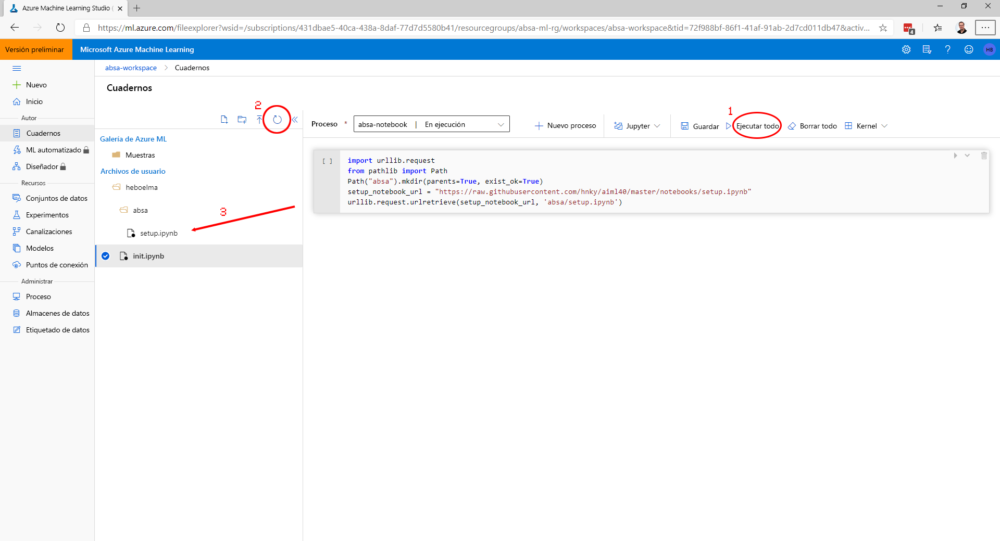

# <a name="setup-azure-machine-learning-demo"></a>Configuración de la demostración de Azure Machine Learning

La forma más fácil de configurar un entorno es usar la CLI de Azure con el complemento Azure Machine Learning.

### <a name="install-the-azure-cli"></a>Instalación de la CLI de Azure
Siga las instrucciones que se indican en los documentos: [Instalar la CLI de Azure](https://docs.microsoft.com/en-us/cli/azure/install-azure-cli?view=azure-cli-latest/?wt.mc_id=msignitethetour2019-github-aiml40)

### <a name="or"></a>O

Usar [Azure Cloud Shell](https://docs.microsoft.com/en-us/azure/cloud-shell/overview/?wt.mc_id=msignitethetour2019-github-aiml40) para ejecutar los comandos que hay a continuación.

### <a name="install-the-ml-add-on"></a>Instalación del complemento de ML
```
az extension add -n azure-cli-ml
```


### <a name="login-to-your-subscription"></a>Inicio de sesión en su suscripción
> Si está usando Cloud Shell, no es necesario que inicie sesión en su suscripción. Vaya directamente a Configuración de Azure Machine Learning Service.

```
az login
az account list
az account set -s <subscription_id> 
```

### <a name="setup-the-azure-machine-learning-service"></a>Configuración de Azure Machine Learning Service
Los siguientes comandos crearán un grupo de recursos vacío "absa-ml-rg" y una nueva área de trabajo "absa-workspace" en la región de Europa occidental.
```
az group create -l westeurope -g absa-ml-rg
az ml workspace create -w absa-workspace -l westeurope -g absa-ml-rg
```

- Vaya a [ml.azure.com](https://ml.azure.com/).
- Seleccione la suscripción y el área de trabajo.
- (1) En el menú de la izquierda, vaya a Cuadernos.
- (2) Haga clic en "Crear nuevo archivo".
- Cree un nuevo archivo con el nombre "init. ipynb" y el tipo de archivo: Cuaderno de Python. Deje el directorio de destino preseleccionado.
- (3) Haga clic en "Nuevo proceso".
- Cree una instancia de nuevo proceso: Nombre de proceso: "absa-notebook-youralias" (el nombre de proceso debe ser único) y Tamaño de la máquina virtual: "Standard_D3_v2" Deje todo lo demás como predeterminado.
- Espere hasta que se cree el proceso *(a veces es necesario que haga clic en actualizar)* .


- Haga clic en el archivo "init. ipynb" (es posible que tenga que seleccionar el botón "Editar en" y elegir en línea).
- Pegue el código siguiente en la celda.

```
import urllib.request
from pathlib import Path
Path("absa").mkdir(parents=True, exist_ok=True)
setup_notebook_url = "https://raw.githubusercontent.com/microsoft/ignite-learning-paths-training-aiml/master/aiml40/absa/notebooks/setup.ipynb"
urllib.request.urlretrieve(setup_notebook_url, 'absa/setup.ipynb')
```

- (1) Haga clic en "Ejecutar todo".
- (2) Haga clic en el botón "Actualizar".
- Tenga en cuenta que se ha creado una carpeta "absa" .

- Abra la carpeta "absa".
- Haga clic en "setup.ipynb".
- Haga clic en la lista desplegable Jupyter y seleccione: "Abrir en Jupyter"
- Ejecute todas las celdas del cuaderno (use Mayús + Entrar para ejecutar una sola celda).


## <a name="your-workspace-is-now-ready-to-run-the-demos"></a>El área de trabajo ya está lista para ejecutar las demostraciones.

> Es posible que tenga que actualizar la pantalla "Cuadernos" para ver los cambios.

### <a name="demo-1---absa"></a>Demostración 1: ABSA
- En "Cuadernos", abra la carpeta absa/cuadernos.
- Haga clic en "absa. ipynb".
- Haga clic en la lista desplegable Jupyter y seleccione: "Abrir en Jupyter"
- Ejecute en todo el cuaderno. 
 - Debería ejecutarse sin cambios.
 - Siga algunas instrucciones en línea para que la demostración sea más fluida.

### <a name="demo-2---absa-hyperparamaters"></a>Demostración 2: hiperparámetros de ABSA
- En "Cuadernos", abra la carpeta absa/cuadernos.
- Haga clic en "absa-hyperdrive. ipynb".
- Haga clic en la lista desplegable Jupyter y seleccione: "Abrir en Jupyter"
- Ejecute en todo el cuaderno. 
 - Debería ejecutarse sin cambios.
 - Siga algunas instrucciones en línea para que la demostración sea más fluida.
